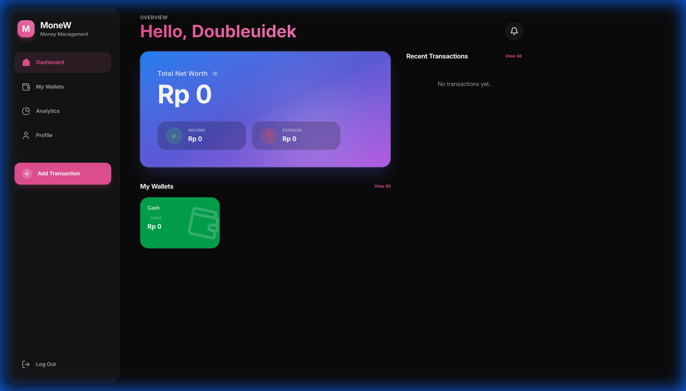

# MoneW - Smart Finance Management



A modern, comprehensive Progressive Web Application (PWA) for personal finance management. Built with the latest web technologies to provide a seamless, app-like experience on both desktop and mobile devices.

## 📱 Live Demo

Access the live application here: **[mone.widifirmaan.web.id](https://mone.widifirmaan.web.id)**

## ✨ key Features

-   **Dashboard Overview**: Get a quick snapshot of your financial health with real-time balance updates and recent transactions.
-   **Transaction Tracking**: Easily add income and expenses with categorized details.
-   **Visual Analytics**: Interactive charts and statistics to visualize spending habits (powered by Recharts).
-   **Wallet & Card Management**: Manage multiple wallets and linked cards in one place.
-   **Responsive PWA Design**: Installable on mobile devices with detailed responsiveness for a native app feel.
-   **Secure Authentication**: Robust user authentication via NextAuth.
-   **Modern UI/UX**: Sleek interface designed with Tailwind CSS v4 and Framer Motion for smooth animations.

## 📸 Screenshots

### Desktop View


### Mobile View


## 🛠️ Tech Stack

-   **Framework**: [Next.js 16](https://nextjs.org/) (App Router)
-   **Language**: [TypeScript](https://www.typescriptlang.org/)
-   **Styling**: [Tailwind CSS v4](https://tailwindcss.com/)
-   **Database**: [MongoDB](https://www.mongodb.com/) (via Mongoose)
-   **Auth**: [NextAuth.js v5](https://authjs.dev/)
-   **Icons**: [Lucide React](https://lucide.dev/)
-   **Animations**: [Framer Motion](https://www.framer.com/motion/)
-   **Charts**: [Recharts](https://recharts.org/)
-   **PWA**: [@ducanh2912/next-pwa](https://github.com/DuCanhGH/next-pwa)

## 🚀 Getting Started

Follow these steps to set up the project locally.

### Prerequisites

-   Node.js (v18 or higher)
-   npm or yarn
-   MongoDB instance

### Installation

1.  **Clone the repository**
    ```bash
    git clone https://github.com/yourusername/nextjs-pwa-moneymanagement.git
    cd nextjs-pwa-moneymanagement
    ```

2.  **Install dependencies**
    ```bash
    npm install
    # or
    yarn install
    ```

3.  **Environment Variables**
    Create a `.env` file in the root directory and configure the following:

    ```env
    DATABASE_URL=your_mongodb_connection_string
    AUTH_SECRET=your_nextauth_secret
    AUTH_URL=http://localhost:3000
    # Add other provider keys if necessary (e.g., Google Client ID/Secret)
    ```

4.  **Run the development server**
    ```bash
    npm run dev
    ```

    Open [http://localhost:3000](http://localhost:3000) with your browser to see the result.

## 📜 Scripts

-   `npm run dev`: Runs the app in development mode.
-   `npm run build`: Builds the app for production.
-   `npm start`: Starts the production server.
-   `npm run lint`: Runs ESLint to check for code quality issues.

## 📂 Project Structure

```
├── app/                # Application source code (App Router)
│   ├── api/            # API Routes
│   ├── stats/          # Statistics page
│   ├── wallets/        # Wallet management
│   ├── cards/          # Card management
│   ├── profile/        # User profile
│   └── ...
├── public/             # Static assets
└── ...
```

## 🤝 Contributing

Contributions, issues, and feature requests are welcome! Feel free to check the [issues page](https://github.com/yourusername/nextjs-pwa-moneymanagement/issues).

## 📄 License

This project is licensed under the [MIT License](LICENSE).
