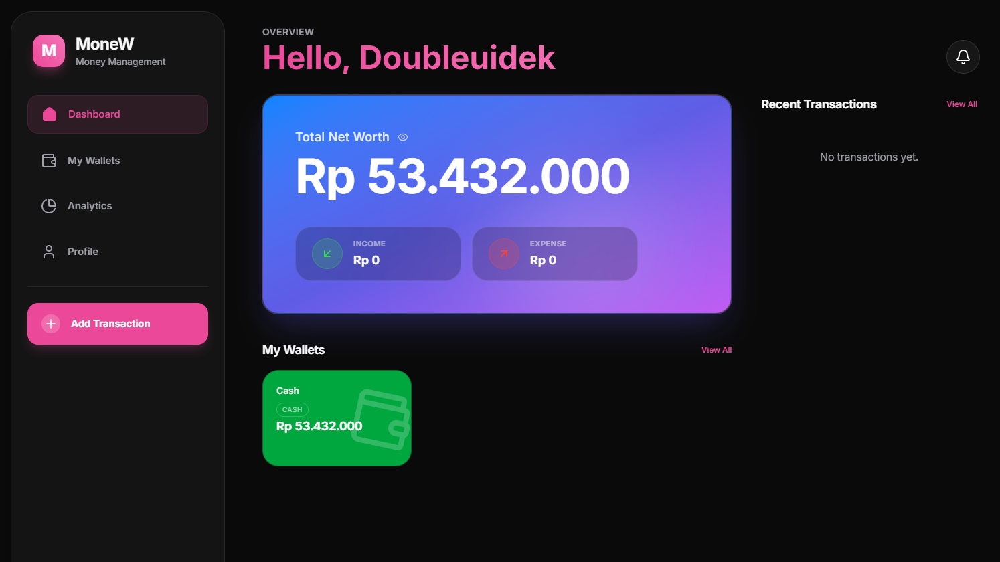
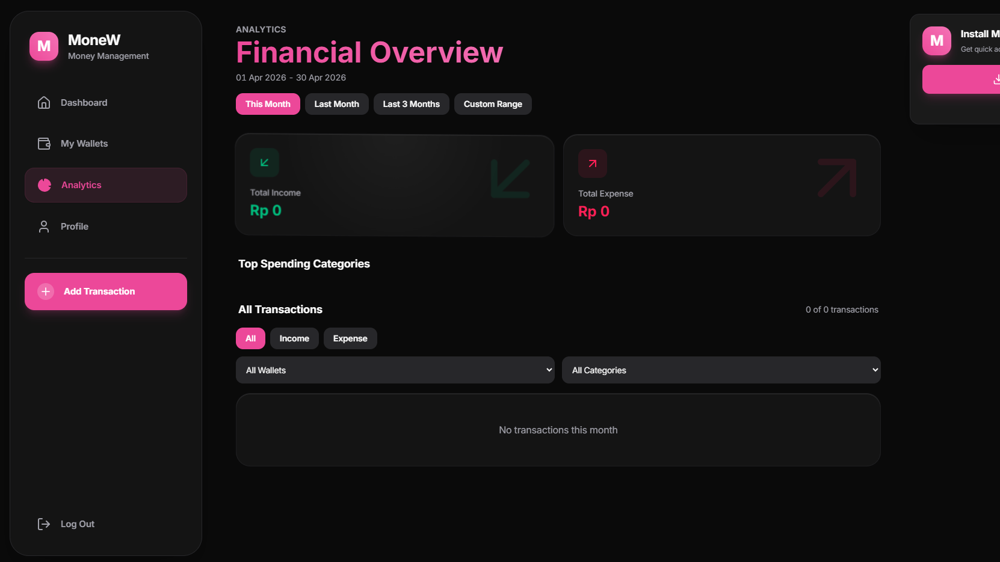
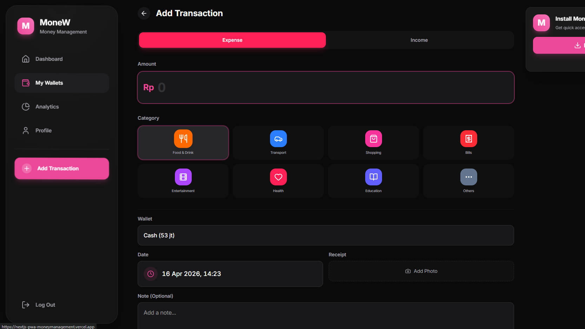
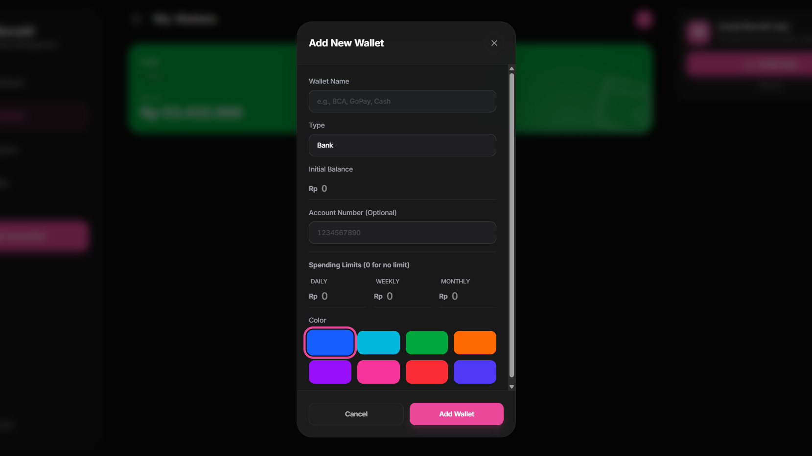
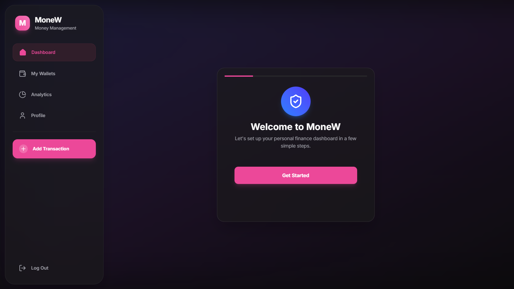
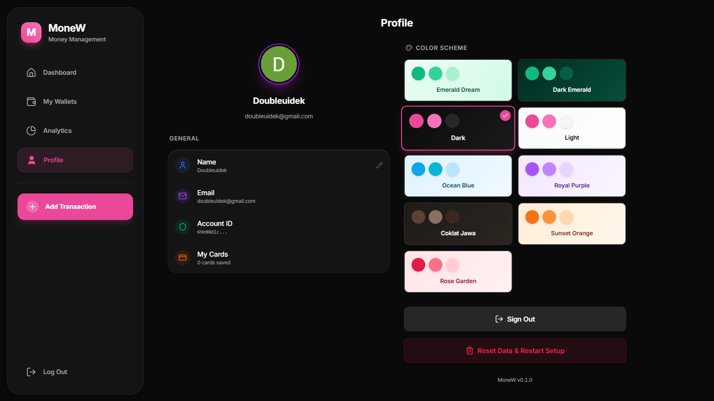
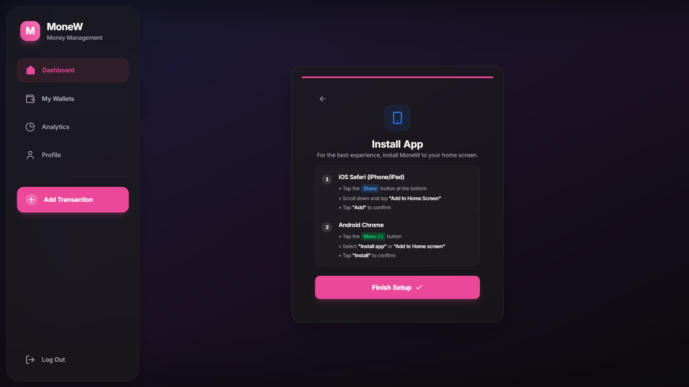
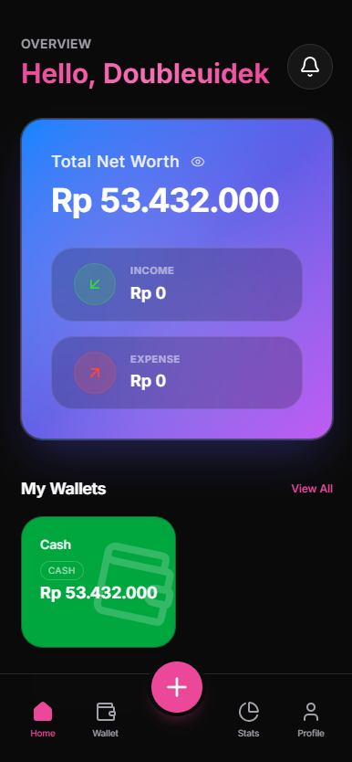

# 💰 MoneW - Next.js 16 PWA Finance Management

**MoneW** is a full-stack Progressive Web Application for personal finance management, built on **Next.js 16 App Router** with **React 19** and **TypeScript**. It utilizes **MongoDB** as the primary data store (via Mongoose), **NextAuth.js v5 (Auth.js)** for authentication with Google OAuth and credential providers, and **Tailwind CSS v4** for styling. The architecture prioritizes performance through **React Server Components (RSC)**, optimized API route handlers, and a robust PWA configuration for offline-first capabilities.


---

Explore the comprehensive features of **MoneW** through our gallery.

| | |
|:---:|:---:|
| <br>**Main Dashboard** | <br>**Financial Analysis** |
| <br>**Transaction Entry** | <br>**Wallet Management** |
| <br>**Initial Configuration** | <br>**User Profile** |
| <br>**PWA Installation** | |
| <br>**Mobile Interface (PWA)** | |

---

### 🏗️ Technical Architecture
*   **Next.js App Router**: Optimized rendering using **Server Components (RSC)** for minimal client-side JS and **Client Components** for rich interactivity.
*   **API Route Handlers**: Secure CRUD operations for transactions, wallets, and cards located in `app/api/`, protected by session middleware.
*   **Auth.js (NextAuth v5)**: Stateless session management using **JWT**, supporting Google OAuth and secure email/password authentication via bcrypt.
*   **Database Singleton**: Efficient MongoDB connection management in `lib/db.ts` to prevent connection leaks in serverless environments.

### 💳 Financial Management
*   **Multi-Wallet System**: Manage multiple cash, bank, or digital wallets with real-time balance synchronization.
*   **Transaction Tracking**: Detailed logging of income and expenses with categorical breakdown and visual reporting.
*   **Card Management**: Specialized tracking for physical and virtual cards, including limit monitoring.
*   **Statistical Analysis**: Dynamic charts powered by **Recharts** providing insights into spending habits and financial health.

### 📱 Progressive Web App (PWA)
*   **Standalone Mode**: Installable on iOS, Android, and Desktop with a native-app feel and dedicated splash screens.
*   **Offline Support**: Service Worker implementation for static asset caching and stale-while-revalidate strategies.
*   **Responsive UI**: Mobile-first design philosophy using **Tailwind CSS v4** and fluid animations with **Framer Motion**.
*   **PWA Setup Wizard**: Seamless onboarding process for users to configure their PWA environment.

---

### 🛠️ Tech Stack
*   **Framework**: Next.js 16 (App Router)
*   **Styling**: Tailwind CSS v4, Framer Motion
*   **Database**: MongoDB Atlas (Mongoose ODM)
*   **Authentication**: NextAuth.js v5 (Auth.js)
*   **Charts**: Recharts
*   **Icons**: Lucide React
*   **Deployment**: Vercel (Edge Network)

---

### 📂 Project Structure
```bash
/
├── app/
│   ├── (auth)/          # Auth routes: login, register
│   ├── api/             # API Route Handlers
│   ├── stats/           # Analytics & Recharts
│   ├── wallets/         # Wallet management
│   ├── cards/           # Card management
│   └── layout.tsx       # Root layout (SessionProvider)
├── components/          # Shared UI components
├── context/             # React Context (Theme, User State)
├── lib/                 # Core logic (DB singleton, Auth config)
├── public/              # PWA assets (manifest, sw.js)
└── screenshot/          # Documentation screenshots
```

---

### 📦 Getting Started

**Prerequisites**
*   **Node.js 18+**
*   **MongoDB** instance (Local or Atlas)

**Installation**
```bash
# Clone the repository
git clone https://github.com/widifirmaan/nextjs-pwa-moneymanagement.git

# Install dependencies
npm install

# Run development server
npm run dev
```

---

### 🔐 Environment Variables
Create a `.env` file in the root directory:
```env
MONGODB_URI=mongodb+srv://<user>:<pass>@<cluster>.mongodb.net/<db>

# Auth.js (NextAuth v5)
AUTH_SECRET=your_random_secret_min_32_chars
AUTH_URL=http://localhost:3000
AUTH_TRUST_HOST=true

# Google OAuth
AUTH_GOOGLE_ID=your_google_client_id
AUTH_GOOGLE_SECRET=your_google_client_secret
```

---

## 👥 Authors
Developed with ❤️ by **Widi Firmansyah**.

---

## 📄 License
MIT License — see [LICENSE](LICENSE).

---

**Built for modern financial freedom** 🚀
