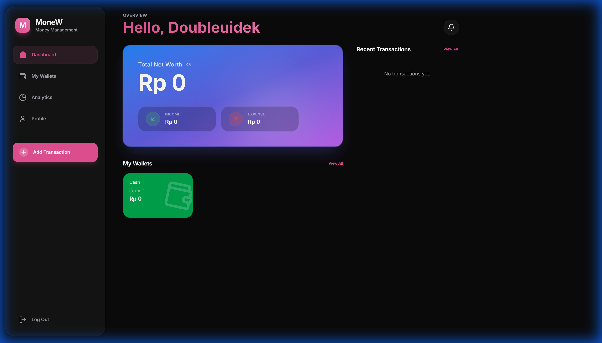
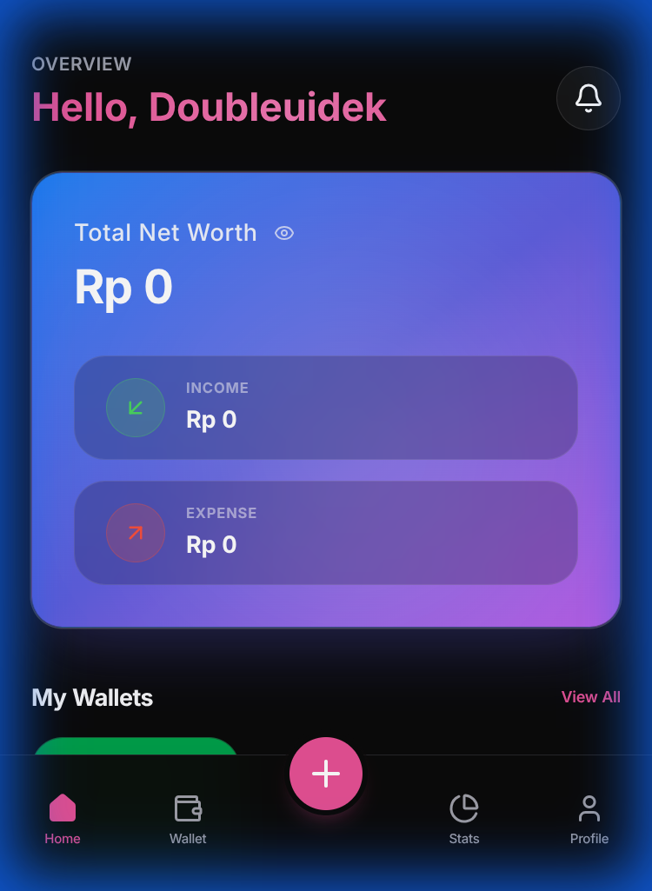

# 💰 MoneW - Smart Finance Management

**MoneW** is a state-of-the-art, web-based Progressive Web Application (PWA) designed for comprehensive personal finance management. Built with the latest **Next.js 16** and **Tailwind CSS v4**, it offers a seamless, app-like experience across all devices with a sleek and modern user interface.


---

## 📱 Live Demo

Access the live application here: **https://nextjs-pwa-moneymanagement.vercel.app/**

---

## 📸 Application Showcase

Explore the intuitive interface of **MoneW** through our gallery.

| | |
|:---:|:---:|
| <br>**Desktop Dashboard** | <br>**Mobile View** |

---

## 🚀 Features Overview

### 📊 Financial Dashboard
*   **Balance Overview**: Get a quick snapshot of your financial health with real-time balance updates.
*   **Recent Transactions**: Stay on top of your latest spending and income at a glance.
*   **Visual Analytics**: Interactive charts and statistics to visualize spending habits (powered by Recharts).

### 💳 Management & Tracking
*   **Transaction Tracking**: Easily add income and expenses with categorized details.
*   **Wallet & Card Hub**: Manage multiple wallets and linked cards in one central location.
*   **Secure Authentication**: Robust user authentication and data protection via NextAuth.js v5.

### 📱 Premium Experience
*   **Progressive Web App**: Installable on mobile devices for a native-like experience.
*   **Modern UI/UX**: Sleek interface designed with Tailwind CSS v4 and Framer Motion for smooth animations.
*   **Fully Responsive**: Meticulously designed to look great on any screen size.

---

## 🛠️ Tech Stack

### Core Framework
*   **Framework**: Next.js 16 (App Router)
*   **Language**: TypeScript
*   **Authentication**: NextAuth.js v5 (Auth.js)

### Frontend & UI
*   **Styling**: Tailwind CSS v4
*   **Animations**: Framer Motion
*   **Icons**: Lucide React
*   **Charts**: Recharts

### Backend & Storage
*   **Database**: MongoDB (via Mongoose)
*   **Adapter**: @auth/mongodb-adapter

---

## 📂 Project Structure

```bash
/
├── app/                # Application source code (App Router)
│   ├── api/            # API Routes
│   ├── stats/          # Statistics page
│   ├── wallets/        # Wallet management
│   ├── cards/          # Card management
│   ├── profile/        # User profile
│   └── ...
├── components/         # Reusable UI components
├── context/            # Global context providers
├── lib/               # Utility functions and configurations
├── public/             # Static assets (images, PWA icons)
├── types/              # TypeScript type definitions
└── ...
```

---

## 📦 Getting Started

### Prerequisites
*   **Node.js 18+**
*   **MongoDB Instance**

### 1. Installation
```bash
git clone https://github.com/widifirmaan/nextjs-pwa-moneymanagement.git
cd nextjs-pwa-moneymanagement
npm install
```

### 2. Environment Variables
Create a `.env` file in the root directory:
```env
# Database
MONGODB_URI=mongodb+srv://<username>:<password>@<cluster>.mongodb.net/<dbname>?retryWrites=true&w=majority

# Auth.js (NextAuth v5)
AUTH_SECRET=your_nextauth_secret
NEXTAUTH_URL=http://localhost:3000
AUTH_URL=http://localhost:3000
AUTH_TRUST_HOST=true

# OAuth Providers (Google)
AUTH_GOOGLE_ID=your_google_client_id
AUTH_GOOGLE_SECRET=your_google_client_secret

# Optional (development bypass login)
DEV_SKIP_AUTH=true
NEXT_PUBLIC_DEV_SKIP_AUTH=true
```

### 3. Run Development
```bash
npm run dev
```
*App runs on `http://localhost:3000`*

---

## 👥 Authors

Developed by **Widi Firmaan**.

---

## 📄 License

This project is licensed under the [MIT License](LICENSE).
