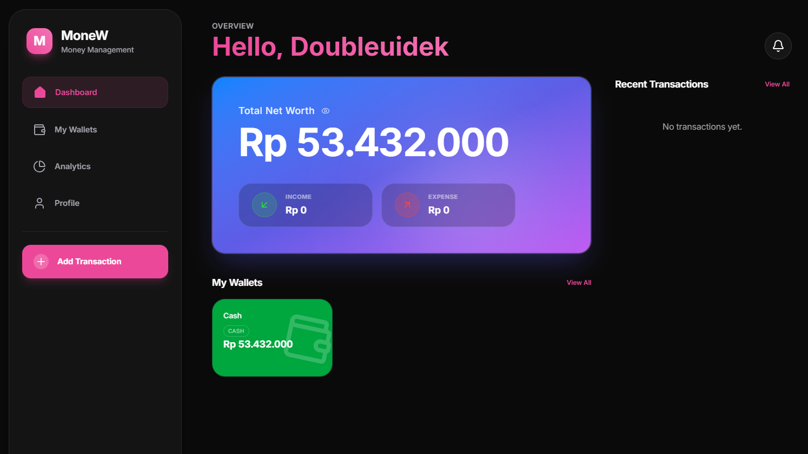
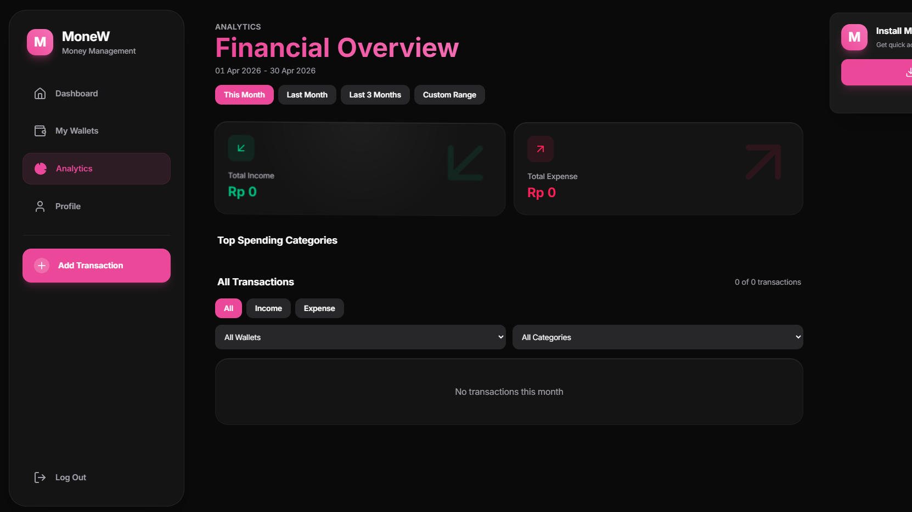
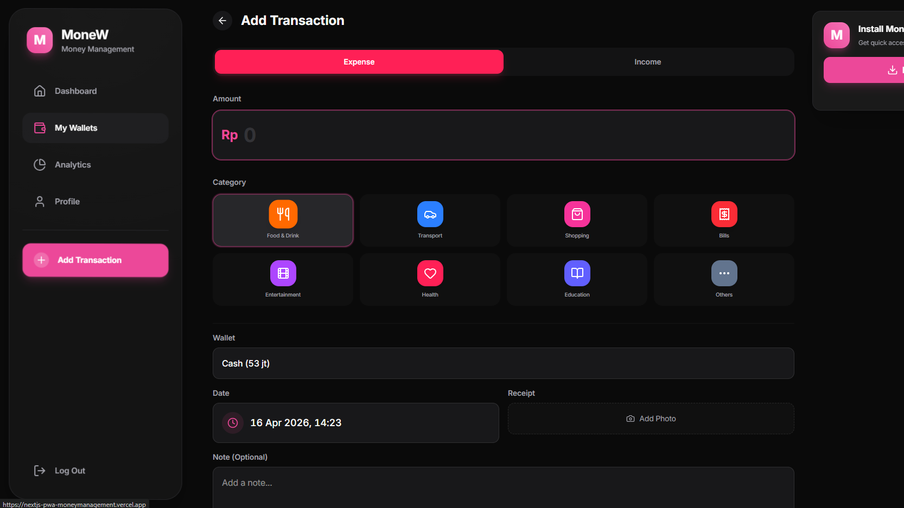
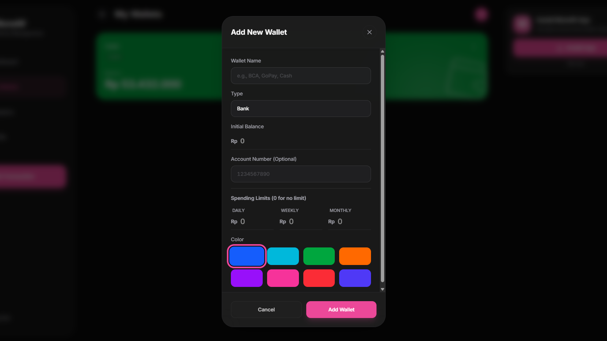
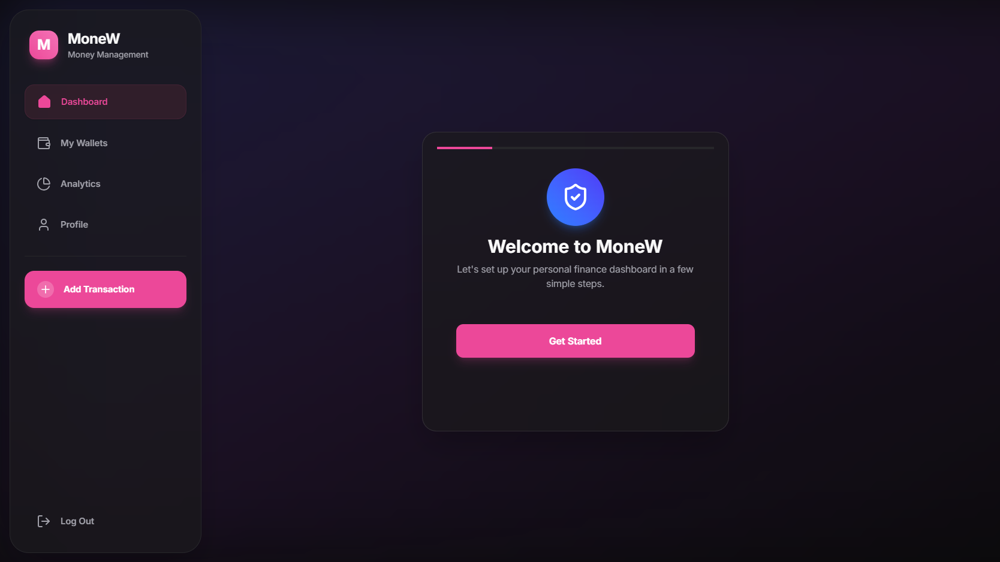
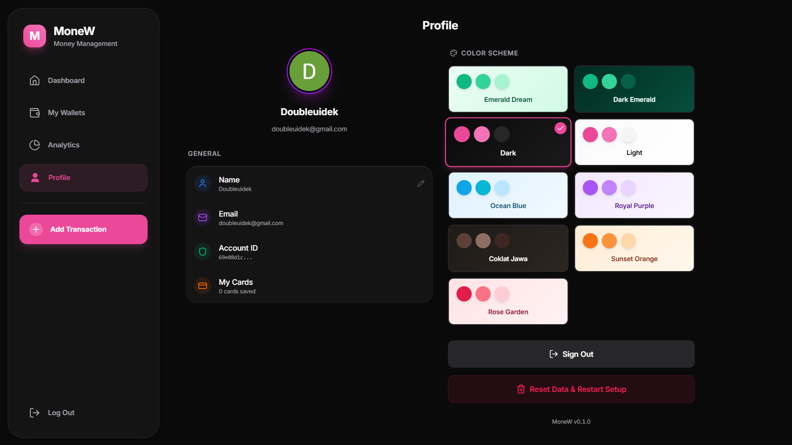
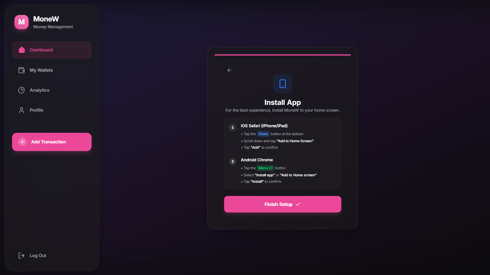
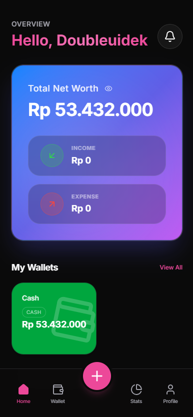

# 💰 MoneW - Next.js 16 PWA Finance Management

**MoneW** is a full-stack Progressive Web Application for personal finance management, built on **Next.js 16 App Router** with **React 19** and **TypeScript**. It runs on **Cloudflare Pages** with a **Cloudflare Workers** API backend and **D1 database** for storage. Authentication is handled via custom **JWT** tokens, and **Tailwind CSS v4** handles styling. The architecture prioritizes performance through static generation, optimized client components, and a robust PWA configuration for offline-first capabilities.


---

Explore the comprehensive features of **MoneW** through our gallery.

| | |
|:---:|:---:|
| <br>**Main Dashboard** | <br>**Financial Analysis** |
| <br>**Transaction Entry** | <br>**Wallet Management** |
| <br>**Initial Configuration** | <br>**User Profile** |
| <br>**PWA Installation** | |
| <br>**Mobile Interface (PWA)** | |

---

### 🏗️ Technical Architecture
*   **Next.js + Cloudflare Pages**: Static site generation with client-side interactivity, deployed globally via Cloudflare's edge network.
*   **Workers API Backend**: All API logic lives in a single Cloudflare Worker (`worker.js`) handling auth, CRUD, file uploads, and data aggregation.
*   **D1 Database**: Cloudflare's serverless SQLite database for transactions, wallets, cards, and user data.
*   **R2 Object Storage**: Cloudflare R2 for storing receipt images and card photos.
*   **Custom JWT Auth**: Stateless authentication using `hs256` tokens stored in `localStorage` with PBKDF2 password hashing.
*   **PWA First**: Fully installable with offline support via Workbox service worker.

### 💳 Financial Management
*   **Multi-Wallet System**: Manage multiple cash, bank, or digital wallets with real-time balance synchronization.
*   **Transaction Tracking**: Detailed logging of income and expenses with categorical breakdown and visual reporting.
*   **Card Management**: Specialized tracking for physical and virtual cards, including limit monitoring.
*   **Statistical Analysis**: Dynamic charts powered by **Recharts** providing insights into spending habits and financial health.

### 📱 Progressive Web App (PWA)
*   **Standalone Mode**: Installable on iOS, Android, and Desktop with a native-app feel and dedicated splash screens.
*   **Offline Support**: Service Worker implementation for static asset caching and stale-while-revalidate strategies.
*   **Responsive UI**: Mobile-first design philosophy using **Tailwind CSS v4** and fluid animations with **Framer Motion**.
*   **PWA Setup Wizard**: Seamless onboarding process for users to configure their PWA environment.

---

### 🛠️ Tech Stack
*   **Framework**: Next.js 16 (App Router) — static export
*   **Styling**: Tailwind CSS v4, Framer Motion
*   **Database**: Cloudflare D1 (SQLite)
*   **Object Storage**: Cloudflare R2
*   **Authentication**: Custom JWT (hs256) with PBKDF2
*   **Charts**: Recharts
*   **Icons**: Lucide React
*   **Deployment**: Cloudflare Pages + Workers

---

### 📂 Project Structure
```bash
/
├── app/                  # Next.js App Router pages
├── components/           # Shared UI components
├── context/              # React Context (Auth, Store, Theme)
├── lib/                  # Utility types and helpers
├── public/               # PWA assets, icons, service worker
├── screenshot/           # Documentation screenshots
├── worker.js             # Cloudflare Workers API backend
├── schema.sql            # D1 database schema
└── wrangler.jsonc        # Cloudflare Pages/Wrangler config
```

---

### 📦 Getting Started

**Prerequisites**
*   **Node.js 18+**
*   **Cloudflare account** with D1 and R2 enabled

**Installation**
```bash
# Clone the repository
git clone https://github.com/widifirmaan/nextjs-pwa-moneymanagement.git

# Install dependencies
npm install

# Run development server
npm run dev
```

**Deploy to Cloudflare**
```bash
# Build static export
npm run build

# Deploy pages + worker
npx wrangler deploy
npx wrangler pages deploy out --branch production
```

---

### 🔐 Environment Variables
Create a `.env` file in the root directory:
```env
# JWT Secret (must match the secret in worker.js)
JWT_SECRET=your_random_secret_min_32_chars
```

> Database schema is managed via `schema.sql` and deployed with `npx wrangler d1 execute monew-db --file=schema.sql`.

---

## 👥 Authors
Developed with ❤️ by **Widi Firmansyah**.

---

## 📄 License
MIT License — see [LICENSE](LICENSE).

---

**Built for modern financial freedom** 🚀
